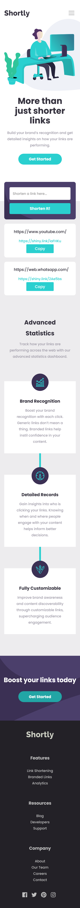
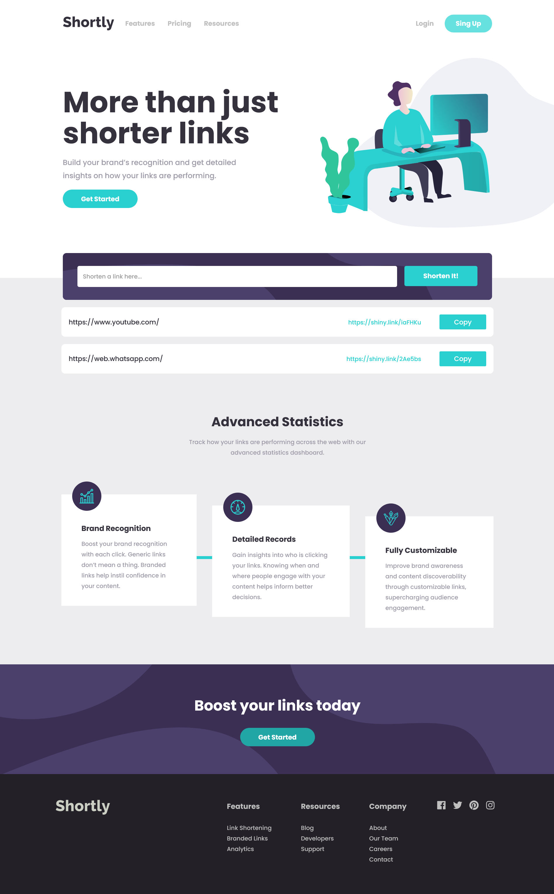

# Frontend Mentor: solución de desafío API de acortamiento de URL en breve

Esta es una solución al [Desafío API de acortamiento de URL breve en Frontend Mentor] (https://www.frontendmentor.io/challenges/url-shortening-api-landing-page-2ce3ob-G). Los desafíos de Frontend Mentor lo ayudan a mejorar sus habilidades de codificación mediante la creación de proyectos realistas.

## Tabla de contenido

- [Frontend Mentor: solución de desafío API de acortamiento de URL en breve](#frontend-mentor-solución-de-desafío-api-de-acortamiento-de-url-en-breve)
  - [Tabla de contenido](#tabla-de-contenido)
  - [Descripción general](#descripción-general)
    - [El reto](#el-reto)
    - [Captura de pantalla](#captura-de-pantalla)
      - [Diseño Mobil](#diseño-mobil)
      - [Diseño Desktop](#diseño-desktop)
    - [Enlaces](#enlaces)
  - [Mi proceso](#mi-proceso)
    - [Construido con](#construido-con)
  - [Autor](#autor)

## Descripción general

### El reto

Los usuarios deberían poder:

- Ver el diseño óptimo para el sitio según el tamaño de pantalla de su dispositivo
- Acortar cualquier URL válida
- Ver una lista de sus enlaces acortados, incluso después de actualizar el navegador
- Copie el enlace acortado a su portapapeles con un solo clic
- Recibir un mensaje de error cuando se envíe el "formulario" si:
   - El campo `entrada` está vacío

### Captura de pantalla

#### Diseño Mobil

#### Diseño Desktop

### Enlaces

- URL de la solución: [Github](https://github.com/jean266/acortador-de-url.git)
- URL del sitio en vivo: [Vencel](https://acortador-de-url.vercel.app/)

## Mi proceso

### Construido con

- Marcado semántico HTML5
- Caja flexible
- Flujo de trabajo móvil primero
- GULP
- SASS
- Modulos
- POO
- [API shrtcode](https://app.shrtco.de/) - API para cortar enlaces

## Autor

- Mentor de frontend - [@jean266](https://www.frontendmentor.io/profile/jean266)

